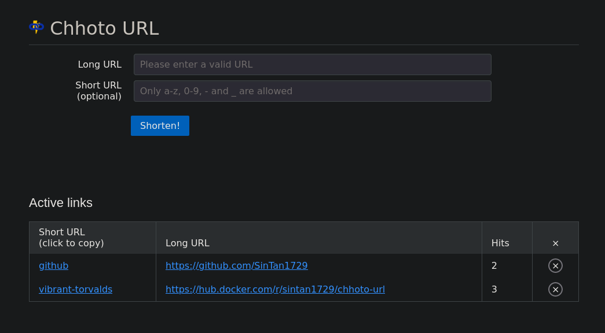

#  <span style="font-size:42px">Simply Shorten</span>

# What is it?
A simple selfhosted URL shortener with no unnecessary features.

Don't worry if you see no activity for a long time. I consider this project
to be complete, not dead. I'm unlikely to add any new features, but I will try
and fix every bug you report.

If you feel like a feature is missing, please let me know by creating an issue
using the "feature request" template.

## But why another URL shortener?
I've looked at a couple popular URL shorteners, however they either have
unnecessary features, or they didn't have all the features I wanted.

# Features
- Shortens URLs of any length to a fixed length, randomly generated string.
- (Optional) Allows you to specify the shortened URL instead of the generated
  one (Missing in a surprising number of alternatives).
- Opening the fixed length URL in your browser will instantly redirect you
  to the correct long URL (you'd think that's a standard feature, but
  apparently it's not).
- Provides a simple API for adding new short links.
- Counts number of hits for each short link in a privacy respecting way
  i.e. only the hit is recorded, and nothing else.
- Allows setting the URL of your website, in case you want to conveniently
  generate short links locally.
- Links are stored in an SQLite database.
- Available as a Docker container.
- Backend written in Rust using [Actix](https://actix.rs/), frontend
  written in plain HTML and vanilla JS, using [Pure CSS](https://purecss.io/)
  for styling.
- Uses very basic authentication using a provided password. It's not encrypted in transport.
  I  recommend using something like [Nginx Proxy Manager](https://nginxproxymanager.com/) to
  encrypt the connection by SSL.
  
# Bloat that will not be implemented
- Tracking or spying of any kind. The only logs that still exist are
 errors printed to stderr and the default SLF4J warning.
- User management. If you need a shortener for your whole organisation, either
 run separate containers for everyone or use something else.
- Cookies, newsletters, "we value your privacy" popups or any of the multiple
other ways modern web shows how anti-user it is. We all hate those, and they're
not needed here.
- Paywalls or messages begging for donations. If you want to support me (for
whatever reason), you can message me through GitLab issues.

# Screenshot


# Usage
## Using `docker compose` (Recommended method)
There is a sample `compose.yaml` file in this repository. It contains
everything needed for a basic install. You can use it as a base, modifying
it as needed. Run it with
```
docker compose up -d
```
If you're using a custom location for the `db_url`, make sure to make that file
before running the docker image, as otherwise a directory will be created in its
place, resulting in an error.
## Building from source
Clone this repository
```
git clone https://gitlab.com/SinTan1729/simply-shorten
```

### 2. Set environment variables
```bash
# Required for authentication
export password=<api password>
# Sets where the database exists. Can be local or remote (optional)
export db_url=<url> # Default: './urls.sqlite'
# Sets the url of website, so that it displays that even when accessed
# locally (optional, defaults to hostname you're accessing it on)
export site_url=<url>
```

### 3. Build and run it
```
cd actix
cargo run
```
You can optionally set the port the server listens on by appending `--port=[port]`
### 4. Navigate to `http://localhost:4567` in your browser, add links as you wish.

## Running with docker
### `docker run` method
0. (Only if you really want to) Build the image
```
docker build . -t simply-shorten:latest
```
1. Run the image
```
docker run -p 4567:4567
    -e password="password"
    -d simply-shorten:latest
```
1.a Make the database file available to host (optional)
```
touch ./urls.sqlite
docker run -p 4567:4567 \
    -e password="password" \
    -v ./urls.sqlite:/urls.sqlite \
    -e db_url=/urls.sqlite \
    -d simply-shorten:latest
```
1.b Further, set the URL of your website (optional)
```
touch ./urls.sqlite
docker run -p 4567:4567 \
    -e password="password" \
    -v ./urls.sqlite:/urls.sqlite \
    -e db_url=/urls.sqlite \
    -e site_url="https://www.example.com" \
    -d simply-shorten:latest
```

## Disable authentication
It's not possible to completely disable authentication. It's rather easy to implement
but there's literally no point. Rather, for testing purposes, you can omit the password
environment variable, and any provided password should work.

This if not recommended in actual use however, as it will allow anyone to create new links and delete
old ones. This might not seem like a bad idea, until you have hundreds of links
pointing to illegal content. Since there are no logs, it's impossible to prove
that those links aren't created by you.

## Notes
- It started as a fork of [this project](https://gitlab.com/draganczukp/simply-shorten).
- The list of adjectives and names used for random short url generation is a modified
  version of [this list used by docker](https://github.com/moby/moby/blob/master/pkg/namesgenerator/names-generator.go).