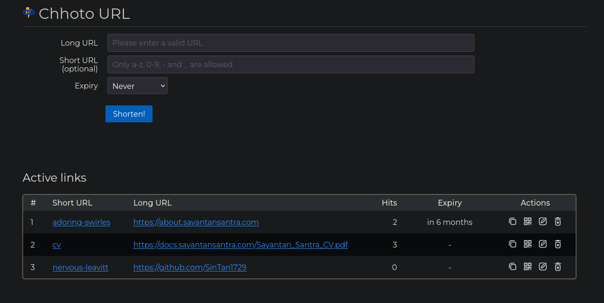
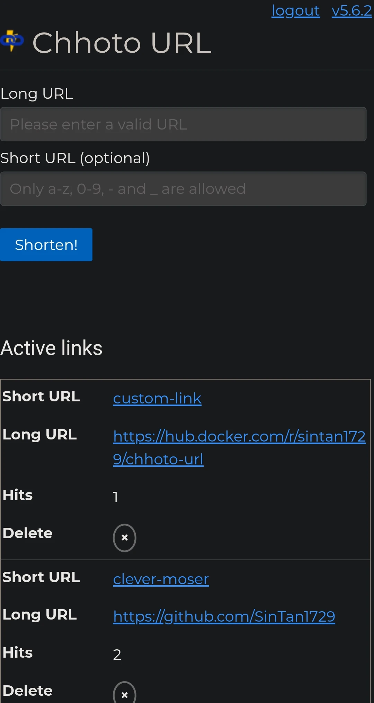

<!-- SPDX-FileCopyrightText: 2023 Sayantan Santra <sayantan.santra689@gmail.com> -->
<!-- SPDX-License-Identifier: MIT -->

#  Chhoto URL

# What is it?
A simple selfhosted URL shortener with no unnecessary features. Simplicity
and speed are the main foci of this project. The scratch docker image is ~6 MB (compressed),
the alpine one is ~9 MB (compressed), and it uses <10 MB of RAM under regular use.

Don't worry if you see no activity for a long time. I consider this project
to be complete, not dead. I'm unlikely to add any new features, but I will try
and fix every bug you report. I will also try to keep it updated in terms of
security vulnerabilities.

If you feel like a feature is missing, please let me know by creating an issue
using the "feature request" template.

## But why another URL shortener?
Most URL shorteners are either bloated with unnecessary features, or are a pain to set up.
Even fewer are written with simplicity and lightness in mind. When I saw the `simply-shorten`
project (linked below), I really liked the idea but thought that it missed some features. Also,
I didn't like the fact that a simple app like this had a ~200 MB docker image (mostly due to the
included java runtime). So, I decided to rewrite it in Rust and add some features to it that I
thought were essential (e.g. hit counting).

## What does the name mean?
Chhoto (ছোট, [IPA](https://en.wikipedia.org/wiki/Help:IPA/Bengali): /tʃʰoʈo/) is the Bangla word
for small. URL means, well... URL. So the name simply means Small URL.

# Features
- Shortens URLs of any length to a randomly generated link.
- Automatic expiry of links after a chosen time.
- (Optional) Allows you to specify the shortened URL instead of the generated
  one. (It's missing in a surprising number of alternatives.)
- Opening the shortened URL in your browser will instantly redirect you
  to the correct long URL. (So no stupid redirection pages.)
- Super lightweight and snappy. (The docker image is only ~6MB and RAM uasge
  stays under 5MB under normal use.)
- Counts number of hits for each short link in a privacy respecting way
  i.e. only the hit is recorded, and nothing else.
- Supports operation using API key, and lets the user provide hashed password and API key.
- Has a mobile friendly UI, and automatic dark mode.
- Can serve a custom landing page, if needed.
- Has a public mode, where anyone can add links without authentication. Deleting 
  or listing available links will need admin access using the password. It's also 
  possible to completely disable the frontend. It's also possible to force an expiry 
  time for public instances, which might be useful.
- Allows setting the URL of your website, in case you want to conveniently
  generate short links locally.
- Links are stored in an SQLite database.
- Available as a Docker container with a provided compose file.
- Backend written in Rust using [Actix](https://actix.rs/), and frontend
  written in plain HTML and vanilla JS, using [Pure CSS](https://purecss.io/)
  for styling.
- Uses very basic authentication using a provided password. It's not encrypted in transport.
  I  recommend using a reverse proxy such as [caddy](https://caddyserver.com/) to
  encrypt the connection by SSL.
  
# Bloat that will not be implemented
- **Tracking or spying of any kind.** The only logs that still exist are
 errors printed to stderr and some basic logging of configs.
- **User management.** If you need a shortener for your whole organization, either
 run separate containers for everyone or use something else.
- **Cookies, newsletters**, "we value your privacy" popups or any of the multiple
other ways modern web shows how anti-user it is. We all hate those, and they're
not needed here.
- **Paywalls** or messages begging for donations. If you want to buy me a coffee, 
you can message me through GitHub discussions or mail me.

# Screenshots 

  
  

# Installation and configuration
[See here.](./INSTALLATION.md)

# Instructions for CLI usage
[See here.](./CLI.md)

# Official CLI application
It's maintained by me, even though I cannot promise to provide proper support. Take a look at it
[here](https://github.com/SinTan1729/chhoto-url-cli).

# 3rd Party Tools
The following tools are 3rd party, and are not supported officially. If you have any problems with them, please file an issue
in the respective repos.
## Browser extension
There's an (unofficial) browser extension maintained by @SolninjaA for shortening URLs easily using Chhoto URL. 
[You can take a look at it here.](https://github.com/SolninjaA/Chhoto-URL-Extension)

## Raycast extension
There's an (unofficial) Raycast extension maintained by @paranoidPhantom for shortening URLs efficiently using Chhoto URL.
[You can get it from the Raycast extension store.](https://www.raycast.com/andrei_hudalla/chhoto)

## FreeBSD port
There's an (unofficial) FreeBSD port maintained by @jcpsantiago for installing Chhoto URL.
[You can take a look at it here.](https://tangled.sh/@jcpsantiago.xyz/freebsd-ports/tree/main/www/chhoto-url)
Feel free to discuss any issues or suggestions in [#56](https://github.com/SinTan1729/chhoto-url/discussions/56).

# Notes
- It started as a fork of [`simply-shorten`](https://gitlab.com/draganczukp/simply-shorten).
- The list of adjectives and names used for random short url generation is a modified
  version of [this list used by docker](https://github.com/moby/moby/blob/master/pkg/namesgenerator/names-generator.go).
- Although it's unlikely, it's possible that your database is mangled after some update. For mission critical use cases,
  it's recommended to keep regular versioned backups of the database, and sticking to a minor release tag e.g. 5.8.
- If you intend to have more than a few thousand shortlinks, it's strongly recommended that you use the UID `slug_style`
  with a `slug_length` of 16 or more.
